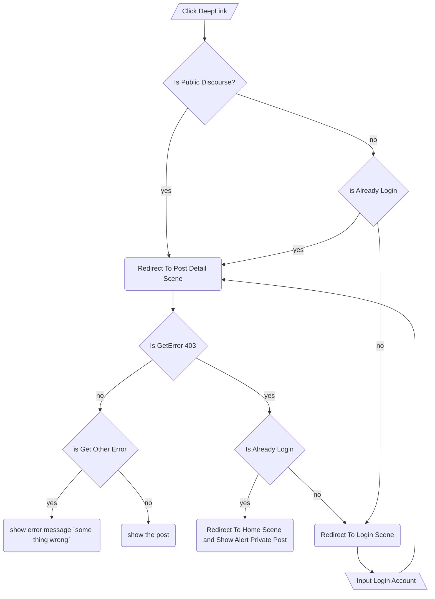
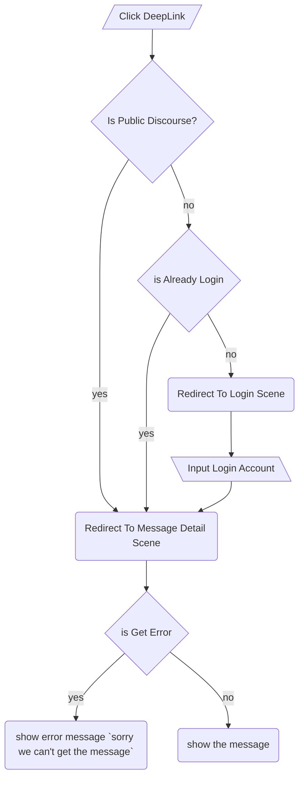

# Deep Link

## Overview

Lexicon supports deep linking with our plugin discourse-lexicon-plugin. Currently, we have two types of deep links: post and message.

A post deep link will contain information such as the post title and post number. For example: {baseDeepLinkUrl}/post-detail/t/welcome-to-our-community/7.

On the other hand, a message deep link will include the title and message ID. For instance: {baseDeepLinkUrl}/message-detail/t/test/55/1.

## Flow Navigate DeepLink in lexicon app

### Post Detail

This is a flow of diagram of post detail deep link

### Message Detail

This is a flow diagram of message detail deep link

## Note

1. We will encounter a 403 error when attempting to make a request to the topicDetail query for private posts. To provide more details on this issue, please refer to PR [#1100](https://github.com/kodefox/lexicon/pull/1100), which offers a more comprehensive description.

2. In our code, we store the deep link path in a hook, which can be found in the file `AppNavigator.tsx`. The code checks if the user is not logged in and then saves the path of the deep link, for example, `t/welcome-to-our-community/7`. This path is handled in the login process, where the user is automatically redirected to the specific route, either the message or post detail scene.
